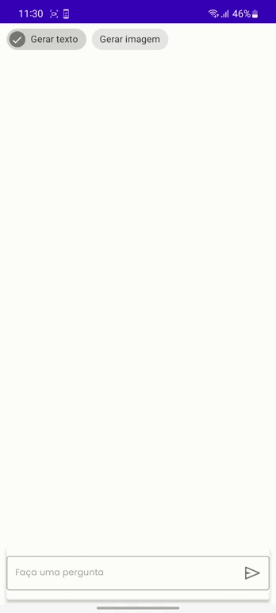
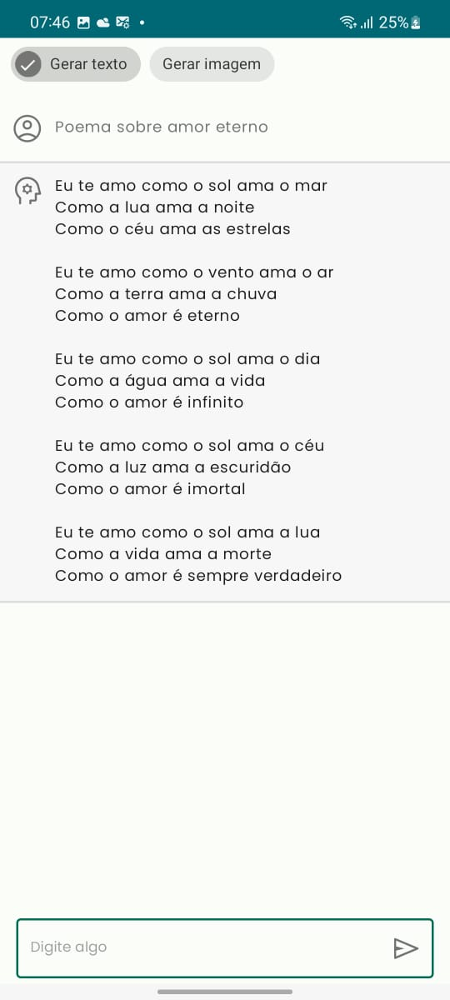
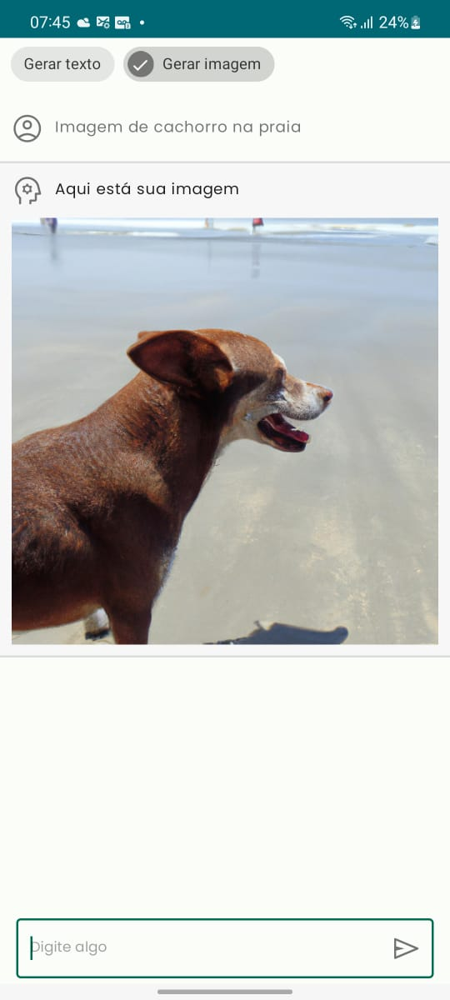

<h1 align="center">Chat-Open-Ai</h1>

<p align="center">
  <a href="https://opensource.org/licenses/Apache-2.0"></a>
  <a href="https://android-arsenal.com/api?level=21"></a>
  <br>
  <a href="https://wa.me/+5574999637391"></a>
  <a href="https://www.linkedin.com/in/pedro-henrique-de-souza-araujo/"></a>
  <a href="pedro.steam2016@hotmail.com"></a>
</p>

<p align="center">  
⭐ Esse é um projeto para demonstrar meu conhecimento técnico no desenvolvimento Android nativo com Kotlin. Mais informações técnicas abaixo.

Aplicativo que permite o usuário se comunicar com uma Inteligência Artificial(GPT-3), para obter informações/respostas, completar algum texto ou gerar imagens.
</p>
</br>

<p float="left" align="center">
 
</p>

## Download
Faça o download da <a href="apk/app-debug.apk?raw=true">APK diretamente</a>. Você pode ver <a href="https://www.google.com/search?q=como+instalar+um+apk+no+android">aqui</a> como instalar uma APK no seu aparelho android.

## Tecnologias usadas e bibliotecas de código aberto

- Minimum SDK level 21
- [Linguagem Kotlin](https://kotlinlang.org/)

- Jetpack
  - Navigation Component: O Navigation Component ajuda você a implementar a navegação, desde simples cliques em botões até padrões mais complexos, como barras de aplicativos e a gaveta de navegação.
  - Lifecycle: Observe os ciclos de vida do Android e manipule os estados da interface do usuário após as alterações do ciclo de vida.
  - ViewModel: Gerencia o detentor de dados relacionados à interface do usuário e o ciclo de vida. Permite que os dados sobrevivam a alterações de configuração, como   rotações de tela.
  - ViewBinding: Liga os componentes do XML no Kotlin através de uma classe que garante segurança de tipo e outras vantagens.
  - Custom Views: View customizadas feitas do zero usando XML.

- Arquitetura
  - MVVM (View - ViewModel - Model) com Clean Architecture
  - Comunicação da ViewModel com a View através de LiveData
  - Comunicação da ViewModel com a Model através de UseCases
  - Repositories para abstração da comunidação com a camada de dados.
  - Injeção de dependência com Hilt.
  
- Bibliotecas
  - [Retrofit2 & OkHttp3](https://github.com/square/retrofit): Para realizar requisições seguindo o padrão HTTP.
  - [Picasso](https://github.com/square/picasso): Para carregamento de imagens.

## Arquitetura
**Chat OpenAi** utiliza a arquitetura MVVM com Clean Architecture, que segue as [recomendações oficiais do Google](https://developer.android.com/topic/architecture).
</br></br>
<p float="left" align="center">
 
</p>
<br>

## API de terceiros
OpenAi Api: https://openai.com/api/
Api capaz de gerar e editar imagens, textos e respostas.

## Features
<p float="left" align="center">
 
  
</p>

# Licença
```xml
  Copyright [2023] [Pedro Henrique de Souza Araujo]

   Licensed under the Apache License, Version 2.0 (the "License");
   you may not use this file except in compliance with the License.
   You may obtain a copy of the License at

     http://www.apache.org/licenses/LICENSE-2.0

   Unless required by applicable law or agreed to in writing, software
   distributed under the License is distributed on an "AS IS" BASIS,
   WITHOUT WARRANTIES OR CONDITIONS OF ANY KIND, either express or implied.
   See the License for the specific language governing permissions and
   limitations under the License.
```
